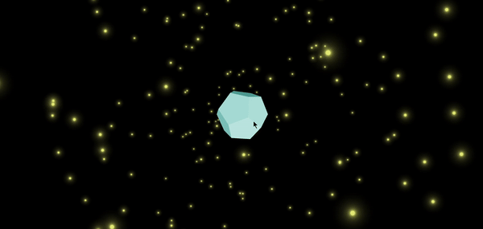

# test-react-three
This is a React project that utilizes React Three Fiber and Drei to render an interactive 3D rotating dodecahedron. The dodecahedron rotates continuously, with added sparkles for a dynamic visual effect.

 

## Demo


## Features
- Interactive 3D dodecahedron with rotation and sparkle effects.
- User can zoom, pan, and rotate the camera view.
- Sparkle effect using Drei's `Sparkles` component.

## Installation

1. Clone the repository:
   ```bash
   git clone https://github.com/SaadiaEl08/test-react-three.git
   ```
2. Navigate to the project directory:
   ```bash
   cd test-react-three
   ```
3. Install dependencies:
   ```bash
   npm install
   ```

## Usage
To start the app in development mode:
```bash
npm run dev
```
The project will be running at [http://localhost:5173](http://localhost:5173).

## Components
- **App.js**: Contains the main Canvas setup, camera controls, and scene lighting.
- **RotatingDodecahedron.js**: Defines the rotating dodecahedron mesh with geometry, material, and sparkle effects.

## Libraries Used
- **[@react-three/fiber](https://github.com/pmndrs/react-three-fiber)**: A React renderer for Three.js.
- **[@react-three/drei](https://github.com/pmndrs/drei)**: Useful helper components for React Three Fiber.

## License
This project is licensed under the MIT License.

This template provides a minimal setup to get React working in Vite with HMR and some ESLint rules.

Currently, two official plugins are available:

- [@vitejs/plugin-react](https://github.com/vitejs/vite-plugin-react/blob/main/packages/plugin-react/README.md) uses [Babel](https://babeljs.io/) for Fast Refresh
- [@vitejs/plugin-react-swc](https://github.com/vitejs/vite-plugin-react-swc) uses [SWC](https://swc.rs/) for Fast Refresh